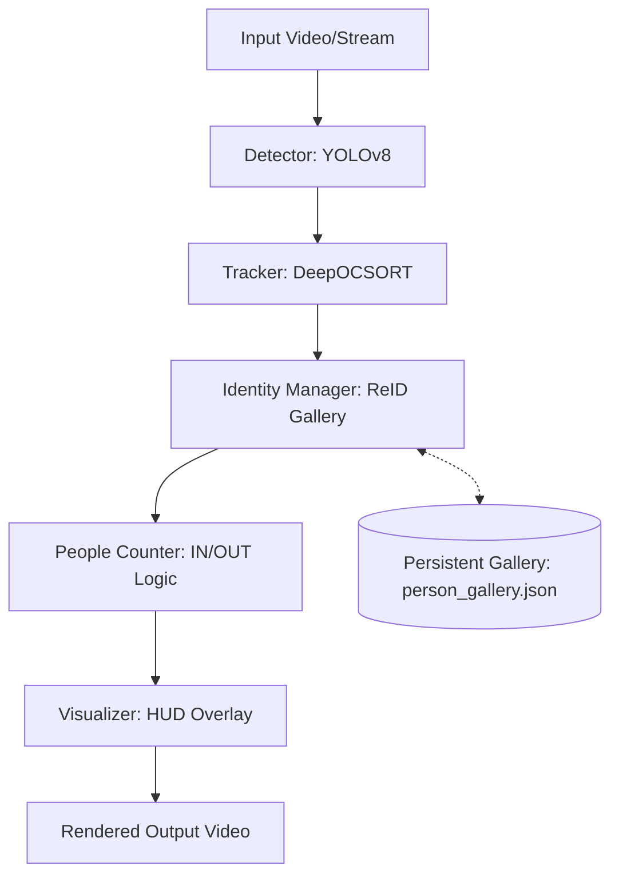

# Project Guide: Robust Person Re-Identification & Counting

This project implements a production-grade person tracking system capable of maintaining **Persistent Global Identities** across entries and exits in a video stream. It is designed for use cases like automated attendance, high-traffic counting, and long-term behavioral analysis.

## 🏗️ System Architecture


The project follows a modular pipeline to ensure high accuracy and stability:



### 1. Detection (YOLOv8)
Locates people in each frame with high precision. It handles different poses and partial occlusions by providing raw bounding boxes for the tracking layer.

### 2. Short-term Tracking (DeepOCSORT)
Associates bounding boxes between consecutive frames using motion prediction and intersection-over-union (IoU). This keeps IDs stable as long as the person is continuously visible.

### 3. Global Identity Manager (OSNet + Hungarian Assignment)
This is the **brain** of the system.
- **Embeddings**: Uses OSNet to create a unique "digital fingerprint" (embedding) of દરેક person based on their face and body structure.
- **Re-Identification**: When a "new" track appears, it compares the person's embedding against a **Global Gallery**.
- **Hungarian Algorithm**: If multiple people enter at once, it uses an optimization algorithm to ensure everyone is matched to their correct previous ID.
- **EMA Smoothing**: Updates the stored embeddings over time to handle changes in lighting or viewpoint.

### 4. Traffic Counting (Directional Line)
Uses a virtual crossing line. It monitors the movement of Global IDs and increments **IN** or **OUT** counts based on the crossing direction. It includes a "hysteresis" zone to prevent double-counting if someone stands on the line.

---

## 📂 Project Structure & Key Files

| File / Folder | Purpose |
| :--- | :--- |
| **`ultimate_person_tracker.py`** | **The main engine.** Comprehensive script combining detection, tracking, re-ID, and counting. |
| `person_gallery.json` | The long-term memory. Stores all identified person embeddings. |
| `boxmot/` | Core tracking library containing implementations of DeepOCSORT, BoTSORT, etc. |
| `osnet_x1_0_msmt17.pt` | The deep learning model for body ReID. |
| `yolov8n.pt` | The lightweight detection model for real-time person finding. |
| `venv310/` | The isolated Python environment with all required dependencies. |
| `test_3.mp4` / `test_4.mp4` | Sample videos for testing and calibration. |

---

## 🚀 How to Run the System

To run the full pipeline on a video and generate a result with a HUD:

```powershell
# Usage:
.\venv310\Scripts\python.exe ultimate_person_tracker.py --source [VIDEO_PATH] --similarity 0.65
```

### Key Parameters:
- `--source`: Path to input video or camera index.
- `--similarity`: How strictly to match returning people (0.6 - 0.75 recommended).
- `--line-ratio`: Position of the counting line (e.g., 0.5 for middle).
- `--gallery`: Path to local database file.

---

## ✨ Key Features
- **Zero ID Switches**: Advanced matching ensures IDs don't jump between people during occlusions.
- **Long-term Persistence**: IDs survive even if a person disappears for hours and returns.
- **Smart Counting**: Deduplicated IN/OUT totals shown on a premium HUD overlay.
- **Scalability**: Capable of handling multiple simultaneous entries using batch ReID assignment.
